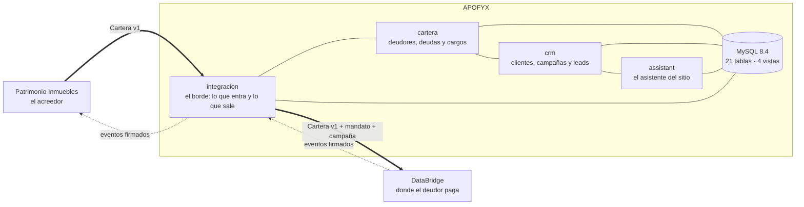
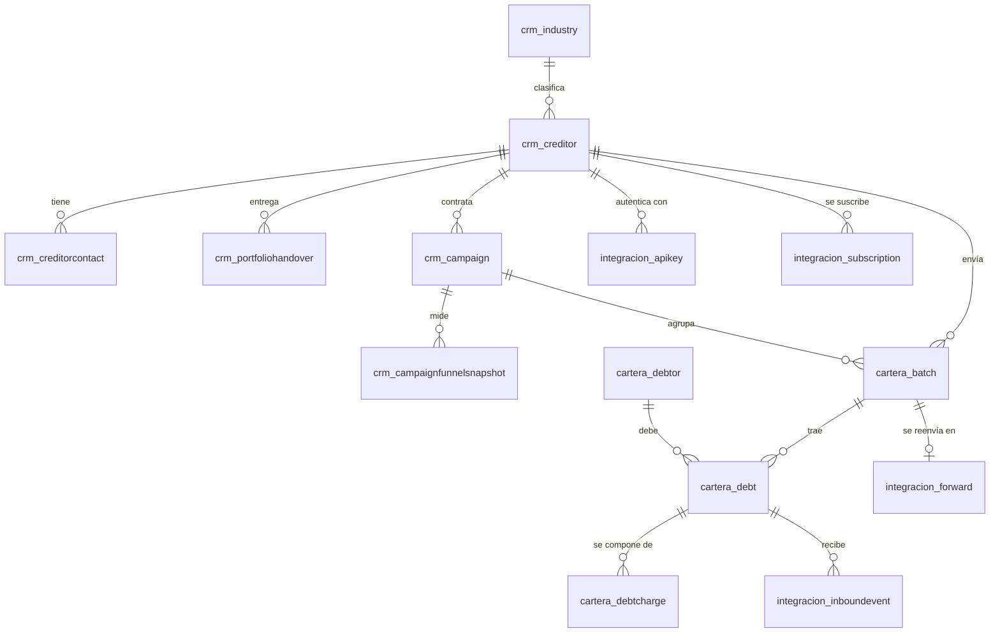

# APOFYX

[](https://github.com/TechnicalBridge/APOFYX/actions/workflows/ci.yml)

Sitio corporativo y panel de una empresa de cobranza extrajudicial. Proyecto de Capstone; la
empresa, los datos y las cifras son ficticios.

**Se levanta con una orden** y queda en http://127.0.0.1:8000 — solo hace falta Docker:

```powershell
docker compose --profile app up -d --build --wait
```

| | |
| --- | --- |
| [1. Descripción](#1-descripción) | [2. Tecnologías](#2-tecnologías-utilizadas) · [3. Cómo ejecutarlo](#3-cómo-ejecutar-el-proyecto-localmente) · [4. Equipo](#4-integrantes-del-equipo) |
| [5. Metodología](#5-metodología-de-trabajo) | [6. Arquitectura](#6-arquitectura-de-la-solución) · [7. Modelo de datos](#7-modelo-de-datos) · [8. Docker](#8-docker) |
| [9. Pruebas](#9-pruebas) | [10. Datos para un modelo](#10-datos-para-un-modelo) |

---

## 1. Descripción

### Qué hace

APOFYX gestiona la cobranza de empresas que tienen muchos clientes morosos de monto bajo
—gimnasios, institutos, clínicas, ISP, gastos comunes—, donde una llamada telefónica cuesta más
de lo que recupera.

Recibe la cartera morosa de sus clientes por API o por archivo, la ordena, calcula la mora y el
tramo de cada deuda, la reparte en campañas, y se la pasa a la plataforma de pagos para que el
deudor pueda pagar solo. Cuando alguien paga, el aviso vuelve y APOFYX pone la cartera al día y
se lo reporta al acreedor.

**APOFYX es puramente operacional.** No procesa pagos y no tiene inteligencia artificial
propia: lo que hace es ordenar carteras, mandar mensajes con plantillas y reportar. La IA y el
gestor de pagos los aporta **DataBridge**. Esa frontera es lo más importante del proyecto y está
explicada en [`docs/APOFYX.md`](docs/APOFYX.md), §7.3 y §13.

### A quién va dirigido

| Quién | Qué hace acá |
| --- | --- |
| **La empresa acreedora** (Patrimonio Inmuebles, un gimnasio, un instituto) | Entrega su cartera morosa y recibe el reporte de lo recuperado |
| **El personal de APOFYX** | Usa el panel: clientes, carteras, campañas y leads |
| **La persona que visita el sitio** | Cotiza el servicio o conversa con el asistente |
| **El deudor** | **No entra acá.** Paga en DataBridge |

### Qué problema resuelve

Una cartera de 6.000 morosos de $40.000 no se puede trabajar a mano: llamar a cada uno cuesta
más que lo que se recupera. Pero tampoco se puede tratar como un número, porque del otro lado
hay una persona que muchas veces **quiere** pagar y no sabe cómo.

APOFYX resuelve la parte operacional de ese problema: recibe la cartera en un formato acordado,
la valida deuda por deuda, calcula en qué tramo de mora está cada una, la agrupa en campañas
medibles, y la entrega a la plataforma donde el deudor paga sin hablar con nadie. Lo que antes
era una planilla que alguien mandaba por correo pasa a ser un flujo que se puede auditar.

---

## 2. Tecnologías utilizadas

| Capa | Tecnología | Por qué |
| --- | --- | --- |
| **Lenguaje** | Python 3.14 | |
| **Framework** | Django 6.1 | Trae el panel de administración, el ORM y las migraciones |
| **Base de datos** | **MySQL 8.4** | El mismo motor que usa DataBridge. El esquema se escribe a mano en SQL y los modelos son su espejo |
| **Frontend** | Bootstrap 5.3 · HTML, CSS y JavaScript sin framework | El sitio es corporativo y el panel es de formularios: un framework de JavaScript sería peso muerto |
| **Estáticos** | WhiteNoise | Sirve CSS e imágenes desde el propio proceso, sin nginx delante |
| **Servidor** | Gunicorn | En contenedor. `runserver` es para desarrollar |
| **Asistente del sitio** | Motor de reglas propio + Google Gemini como respaldo | Decisión D4: las reglas responden lo previsible; el modelo, solo lo que no alcanza el umbral de confianza |
| **Contenedores** | Docker · Docker Compose | |
| **Integración continua** | GitHub Actions | Levanta MySQL 8.4, carga el esquema y corre las pruebas en cada push |

**Nube:** ninguna. La única dependencia externa es la API de Google Gemini para el asistente, y
es opcional: sin `GEMINI_API_KEY` el asistente funciona igual con sus reglas.

---

## 3. Cómo ejecutar el proyecto localmente

### La forma corta: todo en Docker

Lo único que hace falta es **Docker Desktop** corriendo.

```powershell
git clone https://github.com/TechnicalBridge/APOFYX.git
cd APOFYX
docker compose --profile app up -d --build --wait
```

El contenedor espera a que la base responda, aplica las migraciones, junta los estáticos y crea
el usuario del panel antes de servir la primera petición. `--wait` devuelve el control recién
cuando está sano.

| | |
| --- | --- |
| Sitio | http://127.0.0.1:8000/ |
| Panel | http://127.0.0.1:8000/panel/ · usuario `admin`, clave `apofyx2026` |
| Admin de Django | http://127.0.0.1:8000/admin/ |
| Base de datos | `127.0.0.1:3307` · usuario `apofyx_app` |

Para apagar: `docker compose --profile app down`. Con `-v` borra además los datos.

### Para programar

Con la imagen no se programa: se levanta la base en Docker y Django en la máquina, que recarga
al guardar. Hace falta **Docker Desktop** y **Python 3.14**.

```powershell
copy .env.example .env

docker compose up -d              # solo MySQL 8.4, ya poblado

python -m venv .venv
.venv\Scripts\activate
pip install -r requirements.txt

python manage.py migrate --fake-initial
python manage.py createsuperuser

python manage.py runserver
```

Las credenciales de desarrollo están en `.env.example`. **Cámbialas antes de mostrar esto a
alguien.**

> **`--fake-initial` no es un atajo.** El esquema lo crea `sql/AphofyxDB.sql`, y los modelos son
> su espejo. Con esa bandera Django reconoce las tablas existentes y las adopta en vez de
> intentar crearlas de nuevo. De ahí en adelante mandan las migraciones.
>
> La bandera solo cubre las migraciones *iniciales*. Las posteriores que crean algo que el DDL ya
> trae van envueltas en `SiFalta` (`crm/operaciones.py`): en una base nueva lo encuentran y
> siguen; en una antigua lo crean. Y al revés: las que quitan algo que el DDL ya no declara —los
> `CHECK` que enumeraban categorías, desde que son `ENUM`— van envueltas en `SiSobra`.
>
> **Si tu base se aleja del archivo**, `bash sql/rehacer.sh` la vuelve a crear desde
> `sql/AphofyxDB.sql` y te devuelve los datos. Deja un respaldo antes de tocar nada.

---

## 4. Integrantes del equipo

> **⚠ POR COMPLETAR ANTES DE ENTREGAR.** El equipo tiene que llenar la columna de rol.

| Integrante | Rol |
| --- | --- |
| Pedro Campos | |
| Martín Gutiérrez | |
| Flavio Henríquez | |
| Esteban Maino | |

---

## 5. Metodología de trabajo

**Kanban**, con prácticas de **DevOps** para la entrega. El seguimiento tarea por tarea está en
[`TB_web/docs/plan-kanban.md`](https://github.com/TechnicalBridge/TB_web/blob/main/docs/plan-kanban.md),
que cubre los tres sistemas.

En este repositorio, de DevOps se tomaron tres cosas:

| Práctica | Qué resuelve |
| --- | --- |
| **Integración continua** | GitHub Actions levanta MySQL 8.4, **carga el esquema desde el DDL, lo migra con Django y corre las 272 pruebas** en cada push. Si una migración no funciona sobre una base recién creada, la CI se cae |
| **El esquema es la fuente** | `sql/AphofyxDB.sql` se escribe a mano y los modelos son su espejo. Hay pruebas que comparan los dos y fallan si se separan |
| **Infraestructura como código** | Docker Compose levanta la base ya poblada; nadie tiene que "instalar MySQL y correr este script" |

---

## 6. Arquitectura de la solución

APOFYX es un Django monolítico: una sola aplicación con cuatro apps internas, una base de datos
y un panel. No es un sistema distribuido, y no tiene por qué serlo — lo que hace es operar
carteras, y eso cabe en un proceso.

Lo distribuido está **afuera**: APOFYX es la pieza del medio de una cadena de tres empresas.



| App | Qué guarda |
| --- | --- |
| **crm** | Clientes B2B (`crm_creditor`), sus contactos, las carteras que entregan, las campañas y los leads del sitio |
| **cartera** | Deudores, deudas y cargos: lo que el acreedor entrega |
| **integracion** | El borde. Claves de API, lotes recibidos, la bandeja de salida hacia DataBridge y los eventos que vuelven |
| **assistant** | El catálogo del asistente del sitio —intenciones, patrones, respuestas— y las conversaciones |

El nombre de cada app define el prefijo de sus tablas: `crm` → `crm_creditor`, `cartera` →
`cartera_debtor`.

### Recibir la cartera de un cliente

El acreedor entrega su cartera morosa por `POST /api/v1/carteras`, en el formato **Cartera v1**
del [contrato de integración](https://github.com/TechnicalBridge/TB_web/tree/main/docs/integracion).
Primero se le emite su credencial:

```powershell
python manage.py emitir_clave 76418902-7 "Servidor de Patrimonio"
```

La clave se muestra **una sola vez**: en la base queda solo su huella SHA-256. Si se pierde, se
emite otra con `--revocar-anteriores`. Sin claves emitidas nadie puede enviar nada, y APOFYX
funciona igual con la carga a mano del panel.

### Pasársela a DataBridge

Con `DATABRIDGE_URL` y `DATABRIDGE_CLAVE`, cada entrega aceptada se reenvía a DataBridge en el
mismo formato, con el mandato de APOFYX y la campaña agregados. Los montos, los cargos y los ids
de deuda no se tocan.

El reenvío pasa por una **bandeja de salida** (`integracion_forward`), así que el acreedor recibe
su respuesta aunque DataBridge esté caído. Lo que no se pudo entregar se reintenta con esperas
crecientes (1 min, 5 min, 30 min, 2 h, 6 h, 24 h) hasta seis veces:

```powershell
python manage.py despachar_reenvios      # lo pendiente que ya toca
```

En desarrollo el primer intento sale apenas se recibe. En producción conviene
`DATABRIDGE_REENVIO_INMEDIATO=0` y correr `despachar_reenvios` cada minuto con el programador de
tareas: así la recepción queda completamente separada de DataBridge.

Una entrega necesita campaña. Si el acreedor tiene exactamente una en curso, se usa esa; con cero
o con varias queda **esperando campaña** hasta que alguien la asigne en el panel.

### Los eventos de vuelta

Cuando un deudor paga o acepta un plan en DataBridge, DataBridge le avisa a APOFYX, APOFYX pone
al día la deuda y se lo reporta al cliente con el mismo formato. Patrimonio marca pagados los
cargos del contrato sin saber que detrás hay DataBridge.

```powershell
# 1. APOFYX le dice a DataBridge dónde avisarle. Devuelve el secreto con que
#    DataBridge firma: va al .env como DATABRIDGE_SECRETO_EVENTOS.
python manage.py suscribirse_a_databridge https://apofyx.cl/api/v1/eventos

# 2. APOFYX registra dónde avisarle a cada cliente. Devuelve el secreto que el
#    cliente configura de su lado (en Patrimonio, EVENTOS_SECRET).
python manage.py suscribir_cliente 76418902-7 http://localhost:3001/api/eventos
```

| Evento | Qué le pasa a la deuda en APOFYX |
| --- | --- |
| `pago.confirmado` | Se anota. El estado no cambia: el saldo vive en DataBridge |
| `deuda.saldada` | Pasa a **pagada** |
| `repactacion.aceptada` | Pasa a **en convenio de pago**, y la cartera del mes siguiente no la reabre |
| `deuda.disputada` | Pasa a **disputada** |
| `deuda.retirada` | Pasa a **retirada** |

Cada evento se verifica con HMAC y se descarta si tiene más de 5 minutos. El mismo evento dos
veces se procesa una. Los eventos no llegan en orden garantizado, así que un aviso atrasado no
reabre una deuda ya pagada.

---

## 7. Modelo de datos

**21 tablas y 4 vistas**, en `sql/AphofyxDB.sql`. El esquema se escribe a mano, comentado, y los
modelos de Django son su espejo: hay pruebas que comparan los dos y fallan si se separan.

Las categorías —estados, tipos, orígenes— se guardan como **`ENUM`**: MySQL las representa con un
byte por dentro, como si fueran números, pero se leen y se escriben como texto, así que una
consulta dice `status = 'paid'` y no `status = 3`. El `ENUM` **es** la restricción, y por eso esas
columnas no llevan además un `CHECK` repitiendo la lista.

**APOFYX sí guarda deudores y deudas**: es una empresa de cobranza y sin la cartera no tiene nada
que trabajar. Lo que **no existe** es ninguna tabla de pago ni de transacción; el dinero lo mueve
DataBridge y acá solo llega el aviso.

Los nombres dicen el rol de cada cosa en el negocio. El más importante es `crm_creditor`: es **la
empresa acreedora**, la que tiene deudores y contrata a APOFYX. Se llamaba `crm_company`, y ese
nombre no distinguía nada, porque acá hay tres empresas en juego: APOFYX, la acreedora y
DataBridge.



El archivo `sql/AphofyxDB.sql` trae el esquema, los datos de referencia, cinco empresas de
demostración con sus campañas, y el catálogo del asistente (19 intenciones, 117 patrones, 19
respuestas). Docker lo ejecuta solo la primera vez, al inicializar el volumen: si cambias el
script, hace falta `docker compose down -v` para que se vuelva a cargar.

---

## 8. Docker

### Qué se construye

| Imagen | Con qué |
| --- | --- |
| `apofyx/web` | [`Dockerfile`](Dockerfile), dos etapas: la primera instala las dependencias con el compilador de C que necesita `mysqlclient`, la segunda se queda solo con el entorno instalado |
| `mysql:8.4` | Oficial, con `sql/AphofyxDB.sql` montado como script de inicialización |

El contenedor **no corre como root** (usuario `apofyx`, uid 10001) y no usa `runserver`: sirve
con **Gunicorn** y tres trabajadores. Antes de la primera petición, `docker-entrada.sh` espera a
la base, corre `migrate --fake-initial`, junta los estáticos y crea el superusuario si le dieron
las variables.

### Variables de entorno

Todas tienen un valor por omisión, así que el sistema levanta sin configurar nada. Están
documentadas en [`.env.example`](.env.example).

| Variable | Por omisión | Para qué |
| --- | --- | --- |
| `MYSQL_USER`, `MYSQL_PASSWORD`, `MYSQL_ROOT_PASSWORD` | `apofyx_app` / `apofyx_pass` / `rootpass` | La base |
| `DJANGO_SECRET_KEY` | `dev-inseguro-cambiar` | Firma sesiones y formularios. **Cambiar** |
| `DJANGO_DEBUG_DOCKER` | `0` | Variable propia para el contenedor. El `.env` de desarrollo dice `DJANGO_DEBUG=1` y compose lo lee solo, así que sin esta separación el contenedor mostraría la traza completa en cada error |
| `DJANGO_SUPERUSER_USERNAME`, `DJANGO_SUPERUSER_PASSWORD` | `admin` / `apofyx2026` | El usuario del panel. Se crea al arrancar si no existe. Es la misma clave que trae `.env.example` |
| `WEB_PORT` | `8000` | Dónde queda el sitio |
| `DATABRIDGE_URL`, `DATABRIDGE_CLAVE`, `DATABRIDGE_SECRETO_EVENTOS` | vacías | La cadena con DataBridge. Sin ellas APOFYX trabaja solo |
| `GEMINI_API_KEY` | vacía | El respaldo del asistente. Sin ella, responde con reglas |

**Los valores por omisión son de desarrollo y están escritos en un archivo público.**

---

## 9. Pruebas

```powershell
python manage.py test
```

**272 pruebas y 89% de cobertura**, contra MySQL de verdad. Django crea una base aparte
(`test_apofyx`) y la borra al terminar; el permiso para hacerlo lo otorga la Parte 5 de
`sql/AphofyxDB.sql`.

| Tipo | Qué cubre |
| --- | --- |
| **Unitarias** | El motor del asistente, el cálculo de mora y tramo, el módulo 11 del RUT, la firma HMAC de los eventos, los formularios |
| **De integración** | Las vistas del sitio y del panel, la ingesta de cartera completa (aceptación parcial, idempotencia, retiros), el reenvío a DataBridge con su bandeja de salida |
| **De esquema** | Comparan `sql/AphofyxDB.sql` con los modelos: si un `ENUM` del DDL y las opciones del modelo dejan de decir lo mismo, la prueba falla. Es la única forma de detectar esa separación, porque Django arma la base de pruebas desde las migraciones y no desde el DDL |

Ninguna prueba llama a la API de Gemini: el respaldo con modelo se simula. Lo que se verifica no
es que el modelo responda bien, sino que el motor lo invoque en el momento correcto y **degrade
sin romperse** cuando la API falla.

Para medir la cobertura:

```powershell
python -m coverage run --source=crm,assistant,cartera,integracion,config --omit="*/migrations/*,*/tests.py" manage.py test
python -m coverage report -m
```

---

## 10. Datos para un modelo

Las categorías se guardan como texto legible (`'open'`, `'UF'`, `'persona'`). Un modelo, en
cambio, necesita números, así que la codificación vive en una vista aparte: **`v_deuda_features`**.

```powershell
python manage.py exportar_features --acreedor 76418902-7 --salida cartera.csv
```

```python
import pandas as pd
datos = pd.read_csv("cartera.csv")
X = datos.drop(columns=["deuda_id", "acreedor_id", "campana_id", "estado_pagada"])
y = datos["estado_pagada"]
```

| Qué | Cómo se codifica | Por qué |
| --- | --- | --- |
| Tramo de mora | **Label encoding**: `tramo_orden` 0 a 4 | Los tramos tienen orden: a más tramo, más difícil de cobrar. Un número ordenado dice algo real |
| Estado, moneda, tipo de deudor, canales, origen de la entrega | **One-hot**: una columna 0/1 por valor | No tienen orden. Numerarlos le diría al modelo que "pagada" está el doble de lejos de "en gestión" que "en convenio", y eso no significa nada |
| Montos, cargos, días de mora, antigüedad, eventos | Tal cual | Ya son números |

**Por qué no se codifican las tablas.** Guardar `status = 3` en vez de `'paid'` haría ilegible
cualquier consulta y el panel, obligaría a traducir en los dos bordes —el contrato de integración
viaja en texto— y no ganaría nada: el motor no consulta más rápido por eso. Codificar en una vista
deja un solo lugar donde esa decisión vive.

**La mora se mide contra la fecha de corte de la entrega**, no contra hoy, para que la misma deuda
dé siempre el mismo número aunque el modelo se entrene otro día.

---

## Estructura del repositorio

```
APOFYX/
├── config/            proyecto Django: settings y urls raíz
├── crm/               clientes B2B, carteras, campañas y leads
├── assistant/         catálogo del asistente del sitio y conversaciones
├── cartera/           deudores, deudas y cargos que entregan los acreedores
├── integracion/       el borde: cartera que entra y sale, eventos que vuelven
├── templates/         base, sitio público y panel
├── static/            Bootstrap y tipografías en local, tema, animaciones y marca
├── sql/AphofyxDB.sql  esquema físico completo: DDL + datos
├── sql/rehacer.sh     rehace la base desde el DDL conservando los datos
├── Dockerfile         imagen de la aplicación
└── docs/APOFYX.md     documento maestro del caso
```

Todo el caso está en [`docs/APOFYX.md`](docs/APOFYX.md): el modelo de negocio, los actores, el
hallazgo central sobre la brecha de confianza, las métricas, el marco legal chileno y las
decisiones de diseño con su justificación.

---

Este repositorio es una de tres piezas:
[**Patrimonio Inmuebles**](https://github.com/TechnicalBridge/patrimonioinmuebles) → **APOFYX** →
[**DataBridge**](https://github.com/TechnicalBridge/TB_web).
