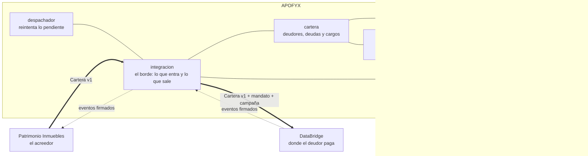
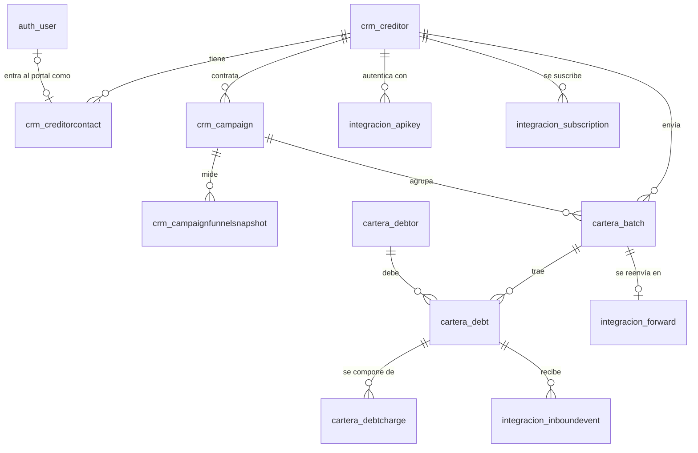

# APOFYX

[](https://github.com/TechnicalBridge/APOFYX/actions/workflows/ci.yml)

Sitio corporativo, panel y portal de empresas de una agencia de **cobranza extrajudicial**.
Proyecto de Capstone; la empresa, los datos y las cifras son ficticios.

**Contexto.** Kobra fue el cliente directo original del equipo y se retiró. APOFYX es el cliente
ficticio creado para continuar el Capstone, no un cliente real. Representa la operación de una
agencia de cobranza dentro de una cadena de tres sistemas:
[Patrimonio Inmuebles](https://github.com/TechnicalBridge/patrimonioinmuebles), el acreedor →
**APOFYX**, la agencia → [DataBridge](https://github.com/TechnicalBridge/TB_web), donde el deudor
paga.

**Se levanta con una orden** y queda en http://127.0.0.1:8000. Solo hace falta Docker:

```powershell
docker compose --profile app up -d --build --wait
```

| | |
| --- | --- |
| [1. Descripción](#1-descripción) | [2. Tecnologías](#2-tecnologías-utilizadas) · [3. Cómo ejecutarlo](#3-cómo-ejecutar-el-proyecto-localmente) · [4. Equipo](#4-integrantes-del-equipo) |
| [5. Metodología](#5-metodología-de-trabajo) | [6. Arquitectura](#6-arquitectura-de-la-solución) · [7. Modelo de datos](#7-modelo-de-datos) · [8. Docker](#8-docker) |
| [9. Pruebas](#9-pruebas) | [10. Datos para un modelo](#10-datos-para-un-modelo) · [Estado al 3 de octubre de 2026](#estado-al-3-de-octubre-de-2026) |

---

## 1. Descripción

### Qué hace

APOFYX gestiona la cobranza de empresas que tienen muchos clientes morosos de monto bajo
—gimnasios, institutos, clínicas, corredoras de propiedades, gastos comunes—, donde una llamada
telefónica cuesta más de lo que recupera.

1. **La empresa se registra sola** en el portal de empresas, y el personal de APOFYX aprueba su
   acceso.
2. **Entrega su cartera** cada mes: por API, con una clave que emite ella misma, o subiendo la
   planilla del contrato. Entrega a todos sus clientes con contrato, deban o no, y APOFYX detecta a
   los morosos.
3. **APOFYX la ordena:** calcula la mora y el tramo de cada deuda, la reparte en campañas y se la
   pasa a la plataforma de pagos, DataBridge, para que el deudor pague solo.
4. **Todo vuelve:** cuando el deudor paga, acepta un convenio o reclama que la deuda no
   corresponde, DataBridge le avisa a APOFYX. APOFYX pone la cartera al día y se lo reporta a la
   empresa, que lo ve en su propio sistema.

**APOFYX cumple el papel operacional.** No procesa pagos: ordena carteras, gestiona campañas y
reporta. El pago, el convenio y el reclamo del deudor viven en DataBridge. El sitio tiene su propio
asistente (`assistant/`), con reglas y Gemini opcional; no hay un modelo predictivo de cobranza
entrenado aquí. El caso completo está en [`docs/APOFYX.md`](docs/APOFYX.md).

### A quién va dirigido

| Quién | Qué hace acá |
| --- | --- |
| **La empresa acreedora** (Patrimonio Inmuebles, un instituto, una clínica) | Entra al portal de empresas (`/empresas/`): entrega su cartera, conecta su sistema y ve qué pasó con cada deuda |
| **El personal de APOFYX** | Usa el panel (`/panel/`): aprueba empresas, crea campañas, conecta la plataforma de pagos y atiende los leads |
| **Quien visita el sitio** | Cotiza el servicio o conversa con el asistente |
| **El deudor** | **No entra acá.** Paga, repacta o reclama en DataBridge |

### Qué problema resuelve

Una cartera de 6.000 morosos de $40.000 no se puede trabajar a mano: llamar a cada uno cuesta más
que lo que se recupera. Tampoco se puede tratar como un número, porque del otro lado hay una
persona que muchas veces **quiere** pagar y no sabe cómo.

APOFYX resuelve la parte operacional:

- recibe la cartera en un formato acordado y la valida deuda por deuda;
- calcula en qué tramo de mora está cada una y la agrupa en campañas medibles;
- la entrega a la plataforma donde el deudor paga sin hablar con nadie;
- le devuelve a la empresa lo que pasó, sin planillas por correo.

Lo que antes era una planilla que alguien mandaba por correo pasa a ser un flujo que se puede
auditar.

---

## 2. Tecnologías utilizadas

| Capa | Tecnología | Por qué |
| --- | --- | --- |
| **Lenguaje** | Python 3.14 | |
| **Framework** | Django 6.1 | Trae el panel de administración, el ORM y las migraciones |
| **Base de datos** | **MySQL 8.4** | El mismo motor que usa DataBridge. El esquema se escribe a mano en SQL y los modelos son su espejo |
| **Frontend** | Bootstrap 5.3 · HTML, CSS y JavaScript sin framework | El sitio es corporativo y el panel es de formularios: un framework de JavaScript sería peso muerto |
| **Estáticos** | WhiteNoise | Sirve CSS e imágenes desde el propio proceso, sin nginx delante |
| **Servidor** | Gunicorn | En contenedor. `runserver` es para desarrollar |
| **Cifrado** | `cryptography` (AES-256-GCM) | Los secretos que hay que leer de vuelta se guardan cifrados |
| **Asistente del sitio** | Motor de reglas propio + Google Gemini como respaldo | Las reglas responden lo previsible; el modelo, solo lo que no alcanza el umbral de confianza |
| **Contenedores** | Docker · Docker Compose | |
| **Integración continua** | GitHub Actions | Levanta MySQL 8.4, carga el esquema y corre las pruebas en cada push |

**Nube:** ninguna. La única dependencia externa es la API de Google Gemini para el asistente, y es
opcional: sin `GEMINI_API_KEY` el asistente funciona igual con sus reglas.

---

## 3. Cómo ejecutar el proyecto localmente

### La forma corta: todo en Docker

Lo único que hace falta es **Docker Desktop** corriendo.

```powershell
git clone https://github.com/TechnicalBridge/APOFYX.git
cd APOFYX
docker compose --profile app up -d --build --wait
```

Levanta tres contenedores: la base, la aplicación y el **despachador**, que reintenta solo lo que
no se pudo entregar ([§6](#pasársela-a-databridge)). Antes de servir la primera petición, la
aplicación espera a la base, aplica las migraciones, junta los estáticos, crea el usuario del panel
y carga la [cartera de la demo](#la-cartera-de-la-demo).

| | |
| --- | --- |
| Sitio | http://127.0.0.1:8000/ |
| Panel del personal | http://127.0.0.1:8000/panel/ · usuario `admin`, clave `apofyx2026` |
| Portal de empresas | http://127.0.0.1:8000/empresas/ · cada empresa crea su cuenta en *Registrar mi empresa* |
| Admin de Django | http://127.0.0.1:8000/admin/ |
| Base de datos | `127.0.0.1:3307` · usuario `apofyx_app` |

Para apagar: `docker compose --profile app down`. Con `-v` borra además los datos.

### Para programar

Con la imagen no se programa: se levanta la base en Docker y Django en la máquina, que recarga al
guardar. Hace falta **Docker Desktop** y **Python 3.14**.

```powershell
copy .env.example .env

docker compose up -d              # solo MySQL 8.4, ya poblado

python -m venv .venv
.venv\Scripts\activate
pip install -r requirements.txt

python manage.py migrate --fake-initial
python manage.py createsuperuser

python manage.py runserver
```

Las credenciales de desarrollo están en `.env.example`. **Cámbialas antes de mostrar esto a
alguien.**

> **`--fake-initial` no es un atajo.** El esquema lo crea `sql/AphofyxDB.sql`, y los modelos son
> su espejo. Con esa bandera Django reconoce las tablas existentes y las adopta en vez de intentar
> crearlas de nuevo. De ahí en adelante mandan las migraciones.
>
> La bandera solo cubre las migraciones *iniciales*. Las posteriores que crean algo que el DDL ya
> trae van envueltas en `SiFalta` (`crm/operaciones.py`): en una base nueva lo encuentran y siguen;
> en una antigua lo crean. Las que quitan algo que el DDL ya no declara van envueltas en `SiSobra`.
>
> **Si tu base se aleja del archivo**, `bash sql/rehacer.sh` la vuelve a crear desde
> `sql/AphofyxDB.sql` y te devuelve los datos. Deja un respaldo antes de tocar nada.

---

## 4. Integrantes del equipo

> **⚠ POR COMPLETAR ANTES DE ENTREGAR.** El equipo tiene que llenar la columna de rol.

| Integrante | Rol |
| --- | --- |
| Pedro Campos | |
| Martín Gutiérrez | |
| Flavio Henríquez | |
| Esteban Maino | |

---

## 5. Metodología de trabajo

**Kanban**, con prácticas de **DevOps** para la entrega. El seguimiento tarea por tarea de los
tres sistemas está en
[`TB_web/docs/plan-kanban.md`](https://github.com/TechnicalBridge/TB_web/blob/main/docs/plan-kanban.md).

En este repositorio, de DevOps se tomaron tres prácticas:

| Práctica | Qué resuelve |
| --- | --- |
| **Integración continua** | GitHub Actions levanta MySQL 8.4, **carga el esquema desde el DDL, lo migra con Django y corre todas las pruebas** en cada push. Si una migración no funciona sobre una base recién creada, la CI se cae |
| **El esquema es la fuente** | `sql/AphofyxDB.sql` se escribe a mano y los modelos son su espejo. Hay pruebas que comparan los dos y fallan si se separan |
| **Infraestructura como código** | Docker Compose levanta la base ya poblada, la aplicación y el despachador; nadie tiene que "instalar MySQL y correr este script" |

---

## 6. Arquitectura de la solución

APOFYX es un Django monolítico: una aplicación con cuatro apps internas, una base de datos y un
panel. No es un sistema distribuido, y no tiene por qué serlo: lo que hace es operar carteras, y
eso cabe en un proceso. Un segundo proceso, el despachador, usa el mismo código para reintentar
las entregas.

Lo distribuido está **afuera**: APOFYX es la pieza del medio de una cadena de tres empresas.


```mermaid
flowchart LR
    PI["Patrimonio Inmuebles<br/>el acreedor"]
    subgraph AP["APOFYX"]
        direction TB
        I["integracion<br/>el borde: lo que entra y lo que sale"]
        C["cartera<br/>deudores, deudas y cargos"]
        R["crm<br/>empresas, campañas y leads"]
        S["assistant<br/>el asistente del sitio"]
        DS["despachador<br/>reintenta lo pendiente"]
        B[("MySQL 8.4<br/>20 tablas · 4 vistas")]
        I --- C
        C --- R
        R --- S
        C --- B
        R --- B
        S --- B
        I --- B
        DS --- I
    end
    DB["DataBridge<br/>donde el deudor paga"]

    PI ==>|"Cartera v1"| I
    I ==>|"Cartera v1 + mandato + campaña"| DB
    DB -.->|"eventos firmados"| I
    I -.->|"eventos firmados"| PI
```

| App | Qué guarda |
| --- | --- |
| **crm** | Las empresas clientes (`crm_creditor`), sus contactos con sus cuentas del portal, las campañas y los leads del sitio. También el panel del personal y el portal de empresas |
| **cartera** | Deudores, deudas y cargos: lo que el acreedor entrega |
| **integracion** | El borde. Claves de API, lotes recibidos, la planilla CSV, la conexión con la plataforma de pagos, la bandeja de salida hacia DataBridge, los eventos que vuelven y los avisos a cada empresa |
| **assistant** | El catálogo del asistente del sitio —intenciones, patrones, respuestas— y las conversaciones |

El nombre de cada app define el prefijo de sus tablas: `crm` → `crm_creditor`, `cartera` →
`cartera_debtor`.

### Una empresa se suma

Nada de esto pasa por la consola ni por el código:

1. **Se registra** en `/empresas/registro/` con el RUT de la empresa (se valida el módulo 11), su
   razón social, su nombre y los datos de la persona que la va a usar. Con un RUT nuevo, se crea la
   empresa en *incorporación*; con uno que ya es cliente, la persona se suma a esa empresa.
2. **El personal aprueba el acceso.** El resumen del panel avisa las cuentas por aprobar, y la ficha
   de la empresa también permite quitarlo. Mientras tanto, el login responde *Tu acceso está en
   revisión*.
3. **La empresa entra al portal** con su correo y su clave:

| Pantalla | Para qué |
| --- | --- |
| **Mi cartera** | Sus entregas, qué pasó con cada deuda y en qué quedó el reenvío a la plataforma de pagos |
| **Subir cartera** | La planilla CSV del contrato, para una empresa sin sistema. La respuesta sale deuda por deuda |
| **Conectar mi sistema** | Emitir y revocar sus claves de API, y registrar dónde recibe los avisos |
| **Mis datos** | Los datos de la empresa y sus contactos |

El personal entra por `/panel/`, que exige `is_staff`: una cuenta de empresa no lo ve. Las sesiones
de los dos se guardan en la base (`django_session`) y duran 8 horas.

### Recibir la cartera de un cliente

El acreedor entrega su cartera por `POST /api/v1/carteras`, en el formato **Cartera v1** del
[contrato de integración](https://github.com/TechnicalBridge/TB_web/tree/main/docs/integracion),
con una clave que emitió en **Conectar mi sistema**.

La clave se muestra **una sola vez**: en la base queda solo su huella SHA-256. Si se pierde, se
revoca y se emite otra. Con la misma clave, su sistema usa las otras dos llamadas del contrato:

| Llamada | Para qué |
| --- | --- |
| `GET /api/v1/cuenta` | Comprobar la clave: responde de qué empresa es y quién la atiende (APOFYX) |
| `POST /api/v1/suscripciones` | Registrar dónde recibe los avisos. Devuelve el secreto con que se firman |

**Cada mes la empresa entrega a todos sus clientes con contrato, deban o no.** El que está al día
viaja con `cargos: []`:

| La deuda | Qué hace APOFYX |
| --- | --- |
| Es nueva | Responde `al_dia` y no guarda nada del cliente |
| Está en gestión | La cierra como retirada, con motivo `pago_directo`: pagó directo al acreedor |
| Ya estaba pagada o retirada | Nada |

La planilla de **Subir cartera** (`integracion/planilla.py`) es el mismo contrato en CSV: se
convierte a Cartera v1 y entra por el mismo camino que la API.

### Pasársela a DataBridge

El personal conecta APOFYX a la plataforma de pagos en **Panel → Plataforma**: pega la dirección y
la clave que DataBridge le emitió a APOFYX, y toca **Conectar**. APOFYX:

1. comprueba la clave con `GET /api/v1/cuenta`;
2. se suscribe a los avisos con `POST /api/v1/suscripciones`;
3. guarda la conexión y el secreto, cifrados, en la base (`integracion_platformconnection`).

Vale al tiro, sin reiniciar nada. Si APOFYX corre en Docker, la dirección de avisos viene prellenada
con `host.docker.internal`, y si alguien pone `localhost` el error explica por qué no llega: dentro
de un contenedor, `localhost` es el propio contenedor.

Cada entrega aceptada se reenvía a DataBridge en el mismo formato, con el mandato de APOFYX y la
campaña agregados. Los montos, los cargos y los ids de deuda no se tocan. El mandato lleva la razón
social y el nombre de la empresa, así que **DataBridge registra solo a un acreedor que no
conocía**.

El reenvío pasa por una **bandeja de salida** (`integracion_forward`), así que el acreedor recibe
su respuesta aunque DataBridge esté caído. El primer intento sale apenas llega la cartera. Lo que no
se pudo entregar lo retoma el **despachador**, un contenedor aparte que revisa las bandejas cada 60
segundos, con esperas crecientes (1 min, 5 min, 30 min, 2 h, 6 h, 24 h) hasta seis veces. Fuera de
Docker, el mismo proceso es:

```powershell
python manage.py despachar_reenvios --cada 60    # sin --cada, una sola pasada
```

Una entrega necesita campaña. Si el acreedor tiene exactamente una en curso, se usa esa. Con cero o
con varias queda **esperando campaña**, y el panel lo avisa en el resumen y en la ficha de la
empresa. Ahí mismo se crea la campaña o se asigna una, y la entrega sale sola.

### El interés de cada deuda

Una deuda puede traer `tasa_interes_mensual`: el interés por mora que la empresa pactó con su
deudor, en porcentaje mensual. Llega por la API o en una columna opcional de la planilla. APOFYX
comprueba que sea un número mayor que 0 (si no, rechaza la deuda con `tasa_invalida`), la guarda y la
reenvía tal cual. Sin tasa, la deuda no genera interés.

Lo cobra DataBridge: suma al saldo la mora de cada día de atraso, la incluye si el deudor repacta, y
rechaza una tasa que supere el tope legal (`tasa_sobre_maxima`). Cuando el deudor paga, el aviso
dice cuánto fue capital y cuánto interés, y APOFYX se lo pasa así a la empresa.

### Las campañas

Una campaña es el plan para contactar a los deudores de una empresa: por qué medio, cuántas veces y
cada cuántos días. **APOFYX la decide y DataBridge la cumple**, mandándole a cada deudor un correo
con su código para entrar al portal (sin el monto ni un enlace).

En la ficha de la empresa, **Nueva campaña** pide:

| Campo | Qué es |
| --- | --- |
| **Nombre y estado** | En curso, pausada o terminada. Solo una campaña en curso contacta |
| **Canales** | Solo **Correo**, lo único que DataBridge envía. WhatsApp y SMS vuelven cuando estén conectados; las campañas anteriores conservan los suyos |
| **Intentos** | Cuántos correos recibe cada deudor, como máximo |
| **Cadencia** | Los días, contados desde que la deuda entra a la campaña, en que sale cada correo: `1, 4, 11, 25, 45` (vacía, esa misma). Van de menor a mayor, hasta 10, y al menos tantos como intentos |
| **Inicio y fin** | Fuera de esas fechas no se contacta |

La ley (Ley 19.496, art. 37) permite escribirle a un deudor **como máximo dos veces por semana, con
dos días entre una y otra**, de lunes a sábado de 8:00 a 20:00 y nunca un feriado. Si la cadencia
pone dos correos más seguidos, el panel lo advierte al guardar, y DataBridge manda el que no cabe en
cuanto puede.

La campaña viaja a DataBridge con la primera entrega, con su cadencia y su estado. Después,
**pausarla, reanudarla o terminarla en el panel le llega al instante a DataBridge**. Si DataBridge
no responde, el panel lo avisa, y el próximo reenvío lo repite. Una deuda pagada, repactada,
disputada o retirada deja de recibir los correos de la campaña.

### El mes siguiente

- **Una deuda pagada vuelve a gestión** si el deudor se atrasa otra vez en el mismo contrato,
  siempre que todos los cargos sean posteriores a los que se pagaron. Si trae cargos viejos, se
  rechaza: lo pagado no se vuelve a cobrar.
- **Una deuda con más de 120 días de mora sale del mandato.** APOFYX la devuelve al acreedor
  (retirada, con motivo `fuera_de_mandato`), se lo dice en la respuesta de esa entrega y le pasa el
  retiro a DataBridge para que deje de cobrarla.

### Los eventos de vuelta

Cuando el deudor paga, acepta un convenio o reclama en DataBridge, DataBridge le avisa a APOFYX.
APOFYX pone al día la deuda y se lo reporta a la empresa con el mismo formato y su propia firma.
Patrimonio, por ejemplo, marca pagados los cargos del contrato sin saber que detrás hay DataBridge.

| Evento | Qué le pasa a la deuda en APOFYX |
| --- | --- |
| `pago.confirmado` | Se anota, con el capital y el interés si lo hubo. El estado no cambia: el saldo vive en DataBridge |
| `deuda.saldada` | Pasa a **pagada** |
| `repactacion.aceptada` | Pasa a **en convenio de pago**, y la cartera del mes siguiente no la reabre |
| `deuda.disputada` | Pasa a **disputada**: el deudor dice que no corresponde y la plataforma la revisa |
| `deuda.reanudada` | La disputa se rechazó: vuelve a **en gestión**, o a **en convenio** si tenía uno. Solo cambia una deuda disputada |
| `deuda.retirada` | Pasa a **retirada**, con su motivo (`disputa_resuelta` si fue por una disputa aceptada) |

Cada evento se verifica con HMAC y se descarta si tiene más de 5 minutos. El mismo evento dos veces
se procesa una. Los eventos no llegan en orden garantizado, así que un aviso atrasado no reabre una
deuda ya pagada.

### La cartera de la demo

Con Docker, APOFYX arranca con la cartera de tres clientes de rubros distintos, cada deudor en una
situación distinta. Es la misma historia que cuentan los datos de ejemplo de DataBridge y de
Patrimonio, vista desde acá. DataBridge cobra desde 30 días de mora; lo que trae menos, APOFYX lo
gestiona por su cuenta.

**Patrimonio Inmuebles**, arriendos:

| Deudor | Qué pasó | Estado en APOFYX |
| --- | --- | --- |
| Felipe Rojas | Aceptó 6 cuotas y lleva 3 pagadas | En convenio de pago |
| Valentina Soto | Debe solo septiembre: 13 días, y DataBridge no la tomó | En gestión |
| Comercial Ñandú | Debe tres meses en UF | En gestión |
| Tomás Fuentes | Pagó en la oficina: la entrega de septiembre lo trae al día, sin cargos | Retirada (pago directo) |
| Rodrigo Pérez | Debe cuatro meses | En gestión |
| Carolina Muñoz | Pagó todo de una vez | Pagada |
| Panadería La Espiga | Aceptó 3 cuotas en UF y pagó la primera | En convenio de pago |
| Ignacio Tapia | Dejó el departamento, aceptó 6 cuotas y no ha pagado ninguna | En convenio de pago |
| Daniela Cáceres | Aceptó 3 cuotas y las pagó juntas | Pagada |

**Instituto Andes**, aranceles mensuales, entregados con la planilla del portal:

| Deudor | Qué pasó | Estado en APOFYX |
| --- | --- | --- |
| Benjamín Araya | Debe tres aranceles | En gestión |
| Antonia Reyes | Debe solo septiembre: 8 días, y DataBridge no la tomó | En gestión |
| Josefina Vidal | Pagó sus dos aranceles | Pagada |

**Clínica Dental Sonrisa Norte**, tratamientos de un solo cargo, entregados por API:

| Deudor | Qué pasó | Estado en APOFYX |
| --- | --- | --- |
| Patricio Muñoz | Debe una ortodoncia vencida en julio | En gestión |
| Fernanda Silva | Aceptó 6 cuotas por un implante y pagó la primera | En convenio de pago |

Entra por el mismo código que una cartera de verdad: las cuatro entregas pasan por
`recibir_cartera`, y los 20 avisos de DataBridge por `recibir_evento`. Lo único distinto es que no
se reenvía nada, porque es historia: ya ocurrió.

```powershell
python manage.py cargar_demo                 # solo los clientes que no tienen cartera
python manage.py cargar_demo --reemplazar    # cambia la que tengan por la de la demo
```

Sin `--reemplazar` nunca pisa nada. Con `--reemplazar` borra solo lo de los tres clientes de la
demo; los deudores que también le deben a otro cliente se quedan. Para arrancar el contenedor sin
demo: `DEMO_DATOS=false`.

---

## 7. Modelo de datos

**20 tablas y 4 vistas**, en `sql/AphofyxDB.sql`. El esquema se escribe a mano, comentado, y los
modelos de Django son su espejo: hay pruebas que comparan los dos y fallan si se separan.

Las categorías —estados, tipos, orígenes— se guardan como **`ENUM`**: MySQL las representa con un
byte por dentro, pero se leen y se escriben como texto, así que una consulta dice
`status = 'paid'` y no `status = 3`. El `ENUM` **es** la restricción, y por eso esas columnas no
llevan además un `CHECK` repitiendo la lista.

**APOFYX sí guarda deudores y deudas**: es una empresa de cobranza y sin la cartera no tiene nada
que trabajar. Lo que **no existe** es ninguna tabla de pago ni de transacción: el dinero lo mueve
DataBridge y acá solo llega el aviso.

El nombre más importante es `crm_creditor`: **la empresa acreedora**, la que tiene deudores y
contrata a APOFYX. No hay tipos de empresa: APOFYX atiende a cualquiera que tenga cobros, así que el
rubro se eliminó. La cartera de una empresa es solo la que entregó, deuda por deuda.


```mermaid
erDiagram
    crm_creditor     ||--o{ crm_creditorcontact   : "tiene"
    auth_user        |o--o| crm_creditorcontact   : "entra al portal como"
    crm_creditor     ||--o{ crm_campaign          : "contrata"
    crm_campaign     ||--o{ crm_campaignfunnelsnapshot : "mide"
    crm_creditor     ||--o{ cartera_batch         : "envía"
    crm_campaign     ||--o{ cartera_batch         : "agrupa"
    cartera_batch    ||--o{ cartera_debt          : "trae"
    cartera_debtor   ||--o{ cartera_debt          : "debe"
    cartera_debt     ||--o{ cartera_debtcharge    : "se compone de"
    crm_creditor     ||--o{ integracion_apikey    : "autentica con"
    cartera_batch    ||--o| integracion_forward   : "se reenvía en"
    cartera_debt     ||--o{ integracion_inboundevent : "recibe"
    crm_creditor     ||--o{ integracion_subscription : "se suscribe"
```

`integracion_platformconnection` queda fuera del diagrama porque no se relaciona con las demás: es
una sola fila, con la conexión a la plataforma de pagos.

**Secretos.** Lo que solo se compara se guarda como huella: las claves de API que emite APOFYX. Lo
que hay que leer de vuelta va **cifrado con AES-256-GCM** (`integracion/cifrado.py`), con una llave
que no está en la base (`CIFRADO_LLAVE`): la clave que DataBridge le dio a APOFYX, el secreto con
que DataBridge firma sus avisos y el secreto con que APOFYX firma los avisos a cada empresa. La
migración `integracion.0007` cifró los que ya estaban guardados.

El archivo `sql/AphofyxDB.sql` trae el esquema, los datos de referencia, empresas de demostración
con sus campañas y el catálogo del asistente (19 intenciones, 117 patrones, 19 respuestas). Docker
lo ejecuta solo la primera vez, al inicializar el volumen: si cambias el script, hace falta
`docker compose down -v` para que se vuelva a cargar.

---

## 8. Docker

### Qué se construye

| Imagen | Con qué |
| --- | --- |
| `apofyx/web` | [`Dockerfile`](Dockerfile), dos etapas: la primera instala las dependencias con el compilador de C que necesita `mysqlclient`; la segunda se queda solo con el entorno instalado |
| `mysql:8.4` | Oficial, con `sql/AphofyxDB.sql` montado como script de inicialización |

La misma imagen corre dos contenedores con `--profile app`:

| Contenedor | Qué hace |
| --- | --- |
| `apofyx-web` | Sirve el sitio, el panel, el portal y la API con **Gunicorn**: tres trabajadores de cuatro hilos, para que una pestaña abierta no deje esperando a la API. Antes de la primera petición, `docker-entrada.sh` espera a la base, corre `migrate --fake-initial`, junta los estáticos, crea el superusuario y carga la demo |
| `apofyx-despachador` | `manage.py despachar_reenvios --cada 60`: reintenta las entregas a DataBridge y los avisos a las empresas. Arranca cuando la aplicación está sana |

Ningún contenedor corre como root (usuario `apofyx`, uid 10001).

### Variables de entorno

Todas tienen un valor por omisión, así que el sistema levanta sin configurar nada. Están
documentadas en [`.env.example`](.env.example).

| Variable | Por omisión | Para qué |
| --- | --- | --- |
| `MYSQL_USER`, `MYSQL_PASSWORD`, `MYSQL_ROOT_PASSWORD` | `apofyx_app` / `apofyx_pass` / `rootpass` | La base |
| `DJANGO_SECRET_KEY` | `dev-inseguro-cambiar` | Firma sesiones y formularios. **Cambiar** |
| `CIFRADO_LLAVE` | `apofyx-cifrado-dev-cambiar` | Cifra en la base la clave de DataBridge y los secretos de los avisos. Si se cambia, hay que volver a conectar la plataforma y las empresas vuelven a registrar su dirección de avisos. **Cambiar** |
| `DJANGO_DEBUG_DOCKER` | `0` | Variable propia del contenedor. El `.env` de desarrollo dice `DJANGO_DEBUG=1` y compose lo lee solo; sin esta separación, el contenedor mostraría la traza completa en cada error |
| `DJANGO_SUPERUSER_USERNAME`, `DJANGO_SUPERUSER_PASSWORD` | `admin` / `apofyx2026` | El usuario del panel. Se crea al arrancar si no existe |
| `WEB_PORT` | `8000` | Dónde queda el sitio |
| `APOFYX_RUT`, `APOFYX_MORA_MAXIMA` | `77305118-6` / `120` | La identidad de APOFYX en el mandato, y hasta cuántos días de mora cobra |
| `DATABRIDGE_REENVIO_INMEDIATO` | `1` | Reenviar apenas llega la cartera. Con `0`, solo el despachador |
| `DEMO_DATOS` | `true` | Carga al arrancar la [cartera de la demo](#la-cartera-de-la-demo) |
| `GEMINI_API_KEY` | vacía | El respaldo del asistente. Sin ella, responde con reglas |

La conexión con DataBridge no va en variables: se hace en **Panel → Plataforma** y queda en la base.

**Los valores por omisión son de desarrollo y están escritos en un archivo público.**

---

## 9. Pruebas

```powershell
python manage.py test
```

**393 pruebas**, contra MySQL 8.4 (2 se omiten cuando el repositorio de TB_web no está al lado).
Django crea una base aparte (`test_apofyx`) y la borra al terminar; el permiso para hacerlo lo
otorga la Parte 5 de `sql/AphofyxDB.sql`.

| Tipo | Qué cubre |
| --- | --- |
| **Unitarias** | El motor del asistente, el cálculo de mora y tramo, el módulo 11 del RUT, la firma HMAC de los eventos, el cifrado de los secretos, los formularios |
| **De integración** | Las vistas del sitio, del panel y del portal de empresas (registro, aprobación, login, claves, planilla CSV); la conexión con la plataforma desde el panel, con la ayuda cuando alguien pone `localhost`; la ingesta de cartera (aceptación parcial, idempotencia, retiros, clientes al día); el reenvío a DataBridge con su bandeja y el despachador que reintenta; la reapertura de una deuda pagada y la devolución por mora; la disputa de punta a punta (disputada, reanudada con y sin convenio, retirada) y que sus avisos le lleguen al acreedor; la tasa de interés que viaja con la deuda, por la API y por la planilla; la campaña con su cadencia y su estado, y que pausarla llegue a DataBridge; la migración que cifra lo que estaba en claro y su vuelta atrás; la cartera de la demo |
| **De esquema** | Comparan `sql/AphofyxDB.sql` con los modelos: si un `ENUM` del DDL y las opciones del modelo dejan de decir lo mismo, la prueba falla. Django arma la base de pruebas desde las migraciones y no desde el DDL, así que es la única forma de detectar esa separación |

Ninguna prueba llama a la API de Gemini: el respaldo con modelo se simula. Se verifica que el motor
lo invoque en el momento correcto y que **degrade sin romperse** cuando la API falla.

Para medir la cobertura:

```powershell
python -m coverage run --source=crm,assistant,cartera,integracion,config --omit="*/migrations/*,*/tests.py" manage.py test
python -m coverage report -m
```

---

## 10. Datos para un modelo

Las categorías se guardan como texto legible (`'open'`, `'UF'`, `'persona'`). Un modelo, en cambio,
necesita números, así que la codificación vive en una vista aparte: **`v_deuda_features`**.

```powershell
python manage.py exportar_features --acreedor 76418902-7 --salida cartera.csv
```

```python
import pandas as pd
datos = pd.read_csv("cartera.csv")
# Selección preliminar. Antes de entrenar hacen falta observaciones temporales.
estados = [columna for columna in datos.columns if columna.startswith("estado_")]
X = datos.drop(columns=["deuda_id", "acreedor_id", "campana_id", *estados,
                       "eventos_recibidos", "intentos_de_contacto"])
y = datos["estado_pagada"]
```

**Límite del ejemplo.** Quitar solo `estado_pagada` produciría fuga de información: las otras
columnas `estado_*` describen el mismo estado. Los eventos y contactos acumulados también pueden
traer información posterior al momento de predecir. La selección de arriba evita esos campos, pero
no convierte una fotografía del estado actual en un dataset predictivo validado: para predecir
pagos hay que definir fecha de observación, horizonte, variables disponibles en esa fecha y una
evaluación separada en el tiempo. Los datos de la demo sirven para probar la exportación, no para
afirmar el rendimiento de un modelo.

| Qué | Cómo se codifica | Por qué |
| --- | --- | --- |
| Tramo de mora | **Label encoding**: `tramo_orden` 0 a 4 | Los tramos tienen orden: a más tramo, más difícil de cobrar |
| Estado, moneda, tipo de deudor, canales, origen de la entrega | **One-hot**: una columna 0/1 por valor | No tienen orden. Numerarlos le diría al modelo que "pagada" está el doble de lejos de "en gestión" que "en convenio" |
| Montos, cargos, días de mora, antigüedad, eventos | Tal cual | Ya son números |

**Por qué no se codifican las tablas.** Guardar `status = 3` en vez de `'paid'` haría ilegible
cualquier consulta y el panel, obligaría a traducir en los dos bordes —el contrato de integración
viaja en texto— y no ganaría nada. Codificar en una vista deja un solo lugar donde esa decisión vive.

**La mora se mide contra la fecha de corte de la entrega**, no contra hoy, para que la misma deuda
dé siempre el mismo número aunque el modelo se entrene otro día.

---

## Estructura del repositorio

```
APOFYX/
├── config/            proyecto Django: settings y urls raíz
├── crm/               empresas, campañas y leads; el panel y el portal de empresas
├── assistant/         catálogo del asistente del sitio y conversaciones
├── cartera/           deudores, deudas y cargos que entregan los acreedores
├── integracion/       el borde: cartera que entra y sale, eventos, cifrado, despachador
├── templates/         base, sitio público, panel y portal de empresas
├── static/            Bootstrap y tipografías en local, tema, animaciones y marca
├── sql/AphofyxDB.sql  esquema físico completo: DDL + datos
├── sql/rehacer.sh     rehace la base desde el DDL conservando los datos
├── Dockerfile         imagen de la aplicación (y del despachador)
└── docs/APOFYX.md     documento maestro del caso
```

[`docs/APOFYX.md`](docs/APOFYX.md) tiene el caso completo: el modelo de negocio, los actores, el
hallazgo sobre la brecha de confianza, las métricas, el marco legal chileno y las decisiones de
diseño con su justificación.

---

## Estado al 6 de octubre de 2026

| Verificación | Resultado |
| --- | --- |
| Suite Django contra MySQL 8.4 | **393 pruebas**, sin fallos |
| Migraciones | `makemigrations --check` sin cambios pendientes; la `0007` aplicada sobre una base con datos cifró la conexión y las suscripciones existentes |
| Contenedores | `apofyx-web` sano y `apofyx-despachador` revisando las bandejas cada 60 segundos |
| Cadena completa | 16 de 16 comprobaciones con Patrimonio y DataBridge reconstruidos: la cartera llega y se reenvía, la disputa y su resolución pasan por APOFYX hasta el acreedor, y el pago vuelve |
| Intereses y campañas, en vivo | La tasa de un contrato de Patrimonio pasó por APOFYX a DataBridge, que cobró la mora con Khipu real, y el pago volvió con el capital y el interés separados. En Edge: la campaña nueva con cadencia y solo correo, con la advertencia de la ley; pausarla y reanudarla en el panel la pausó y la reanudó en DataBridge, y pausada no mandó más correos |

**Lo que no está:**

- **La cobertura no se volvió a medir** en esta revisión; la última medición fue de 90 %.
- **`v_deuda_features` es para análisis:** convertirla en predicción necesita datos en el tiempo
  ([§10](#10-datos-para-un-modelo)).
- **Antes de un despliegue público:** cambiar `DJANGO_SECRET_KEY`, `CIFRADO_LLAVE` y las claves de
  la demo, fijar `DJANGO_ALLOWED_HOSTS` y definir respaldo y retención de datos.
- **Los roles del equipo** en [§4](#4-integrantes-del-equipo).

---

Este repositorio es una de tres piezas:
[**Patrimonio Inmuebles**](https://github.com/TechnicalBridge/patrimonioinmuebles) → **APOFYX** →
[**DataBridge**](https://github.com/TechnicalBridge/TB_web).
