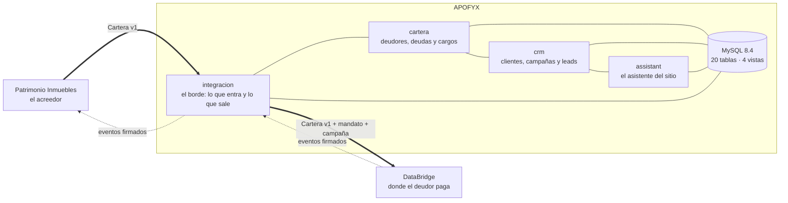
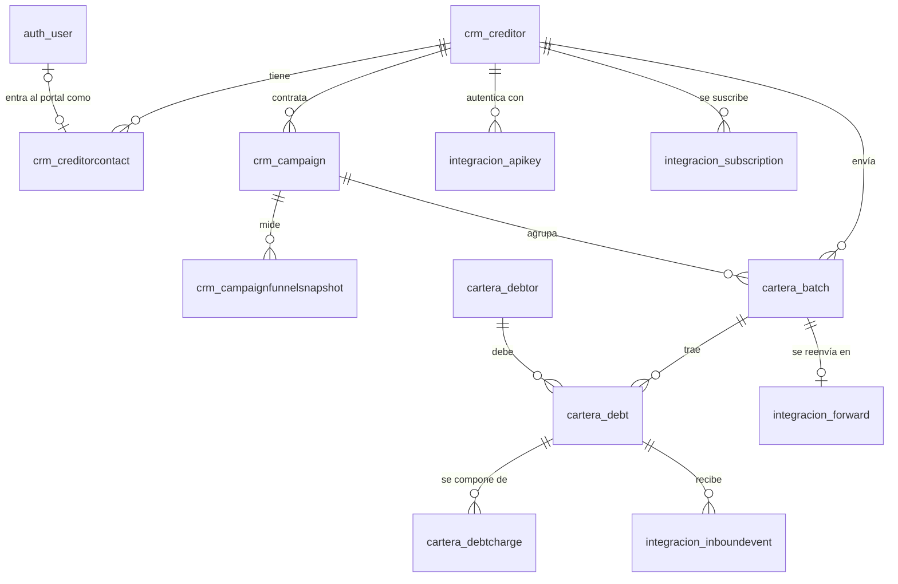

# APOFYX

[](https://github.com/TechnicalBridge/APOFYX/actions/workflows/ci.yml)

Sitio corporativo y panel de una empresa de cobranza extrajudicial. Proyecto de Capstone; la
empresa, los datos y las cifras son ficticios.

**Origen del caso:** Kobra fue el cliente directo original del equipo y se retiró. APOFYX es
el cliente ficticio creado para continuar el Capstone, no un nuevo cliente real. Esta
aplicación representa su operación de cobranza dentro de la cadena con Patrimonio y DataBridge.

La [evaluación local al final de este README](#evaluación-local-del-29-de-septiembre-de-2026)
resume las pruebas ejecutadas y los pendientes. La [evaluación general](../EVALUACION_GENERAL.md)
conecta los tres proyectos cuando se conservan juntos en la carpeta Capstone.

**Se levanta con una orden** y queda en http://127.0.0.1:8000 — solo hace falta Docker:

```powershell
docker compose --profile app up -d --build --wait
```

| | |
| --- | --- |
| [1. Descripción](#1-descripción) | [2. Tecnologías](#2-tecnologías-utilizadas) · [3. Cómo ejecutarlo](#3-cómo-ejecutar-el-proyecto-localmente) · [4. Equipo](#4-integrantes-del-equipo) |
| [5. Metodología](#5-metodología-de-trabajo) | [6. Arquitectura](#6-arquitectura-de-la-solución) · [7. Modelo de datos](#7-modelo-de-datos) · [8. Docker](#8-docker) |
| [9. Pruebas](#9-pruebas) | [10. Datos para un modelo](#10-datos-para-un-modelo) |

---

## 1. Descripción

### Qué hace

APOFYX gestiona la cobranza de empresas que tienen muchos clientes morosos de monto bajo
—gimnasios, institutos, clínicas, ISP, gastos comunes—, donde una llamada telefónica cuesta más
de lo que recupera.

Cada empresa cliente se registra sola en el **portal de empresas**, y el personal de APOFYX
aprueba su acceso. Desde ahí la empresa entrega su cartera: por API, con una clave que emite ella
misma, o subiendo la planilla del contrato. Cada mes entrega a todos sus clientes con contrato,
deban o no, y APOFYX detecta a los morosos.

Después APOFYX ordena la cartera, calcula la mora y el tramo de cada deuda, la reparte en
campañas y se la pasa a la plataforma de pagos, para que el deudor pueda pagar solo. Cuando
alguien paga, el aviso vuelve, APOFYX pone la cartera al día y se lo reporta al acreedor.

**APOFYX cumple el papel operacional.** No procesa pagos: ordena carteras, gestiona campañas
y reporta. El procesamiento de pagos y el asistente del deudor viven en **DataBridge**.
Este repositorio sí implementa el asistente de su propio sitio en `assistant/`, con reglas y
Gemini opcional; no hay un modelo predictivo de cobranza entrenado aquí. La atribución comercial
de la tecnología se explica en [`docs/APOFYX.md`](docs/APOFYX.md), §7.3 y §13.

### A quién va dirigido

| Quién | Qué hace acá |
| --- | --- |
| **La empresa acreedora** (Patrimonio Inmuebles, un gimnasio, un instituto) | Entra al portal de empresas (`/empresas/`): entrega su cartera, conecta su sistema, y ve qué pasó con cada deuda |
| **El personal de APOFYX** | Usa el panel (`/panel/`): aprueba empresas, crea campañas, conecta la plataforma de pagos y atiende los leads |
| **La persona que visita el sitio** | Cotiza el servicio o conversa con el asistente |
| **El deudor** | **No entra acá.** Paga en DataBridge |

### Qué problema resuelve

Una cartera de 6.000 morosos de $40.000 no se puede trabajar a mano: llamar a cada uno cuesta
más que lo que se recupera. Pero tampoco se puede tratar como un número, porque del otro lado
hay una persona que muchas veces **quiere** pagar y no sabe cómo.

APOFYX resuelve la parte operacional de ese problema: recibe la cartera en un formato acordado,
la valida deuda por deuda, calcula en qué tramo de mora está cada una, la agrupa en campañas
medibles, y la entrega a la plataforma donde el deudor paga sin hablar con nadie. Lo que antes
era una planilla que alguien mandaba por correo pasa a ser un flujo que se puede auditar.

---

## 2. Tecnologías utilizadas

| Capa | Tecnología | Por qué |
| --- | --- | --- |
| **Lenguaje** | Python 3.14 | |
| **Framework** | Django 6.1 | Trae el panel de administración, el ORM y las migraciones |
| **Base de datos** | **MySQL 8.4** | El mismo motor que usa DataBridge. El esquema se escribe a mano en SQL y los modelos son su espejo |
| **Frontend** | Bootstrap 5.3 · HTML, CSS y JavaScript sin framework | El sitio es corporativo y el panel es de formularios: un framework de JavaScript sería peso muerto |
| **Estáticos** | WhiteNoise | Sirve CSS e imágenes desde el propio proceso, sin nginx delante |
| **Servidor** | Gunicorn | En contenedor. `runserver` es para desarrollar |
| **Asistente del sitio** | Motor de reglas propio + Google Gemini como respaldo | Decisión D4: las reglas responden lo previsible; el modelo, solo lo que no alcanza el umbral de confianza |
| **Contenedores** | Docker · Docker Compose | |
| **Integración continua** | GitHub Actions | Levanta MySQL 8.4, carga el esquema y corre las pruebas en cada push |

**Nube:** ninguna. La única dependencia externa es la API de Google Gemini para el asistente, y
es opcional: sin `GEMINI_API_KEY` el asistente funciona igual con sus reglas.

---

## 3. Cómo ejecutar el proyecto localmente

### La forma corta: todo en Docker

Lo único que hace falta es **Docker Desktop** corriendo.

```powershell
git clone https://github.com/TechnicalBridge/APOFYX.git
cd APOFYX
docker compose --profile app up -d --build --wait
```

El contenedor espera a que la base responda, aplica las migraciones, junta los estáticos, crea
el usuario del panel y carga la [cartera de la demo](#la-cartera-de-la-demo) antes de servir la
primera petición. `--wait` devuelve el control recién cuando está sano.

| | |
| --- | --- |
| Sitio | http://127.0.0.1:8000/ |
| Panel del personal | http://127.0.0.1:8000/panel/ · usuario `admin`, clave `apofyx2026` |
| Portal de empresas | http://127.0.0.1:8000/empresas/ · cada empresa crea su cuenta en *Registrar mi empresa* |
| Admin de Django | http://127.0.0.1:8000/admin/ |
| Base de datos | `127.0.0.1:3307` · usuario `apofyx_app` |

Para apagar: `docker compose --profile app down`. Con `-v` borra además los datos.

### Para programar

Con la imagen no se programa: se levanta la base en Docker y Django en la máquina, que recarga
al guardar. Hace falta **Docker Desktop** y **Python 3.14**.

```powershell
copy .env.example .env

docker compose up -d              # solo MySQL 8.4, ya poblado

python -m venv .venv
.venv\Scripts\activate
pip install -r requirements.txt

python manage.py migrate --fake-initial
python manage.py createsuperuser

python manage.py runserver
```

Las credenciales de desarrollo están en `.env.example`. **Cámbialas antes de mostrar esto a
alguien.**

> **`--fake-initial` no es un atajo.** El esquema lo crea `sql/AphofyxDB.sql`, y los modelos son
> su espejo. Con esa bandera Django reconoce las tablas existentes y las adopta en vez de
> intentar crearlas de nuevo. De ahí en adelante mandan las migraciones.
>
> La bandera solo cubre las migraciones *iniciales*. Las posteriores que crean algo que el DDL ya
> trae van envueltas en `SiFalta` (`crm/operaciones.py`): en una base nueva lo encuentran y
> siguen; en una antigua lo crean. Y al revés: las que quitan algo que el DDL ya no declara —los
> `CHECK` que enumeraban categorías, desde que son `ENUM`— van envueltas en `SiSobra`.
>
> **Si tu base se aleja del archivo**, `bash sql/rehacer.sh` la vuelve a crear desde
> `sql/AphofyxDB.sql` y te devuelve los datos. Deja un respaldo antes de tocar nada.
>
> **Una base anterior a la integración natural** se pone al día sola con `migrate`: la migración
> `crm.0004` borra los rubros (`crm_industry`) y las entregas manuales
> (`crm_portfoliohandover`), y suma las cuentas del portal. Es un cambio sin vuelta atrás:
> respalda antes con `sql/rehacer.sh`.

---

## 4. Integrantes del equipo

> **⚠ POR COMPLETAR ANTES DE ENTREGAR.** El equipo tiene que llenar la columna de rol.

| Integrante | Rol |
| --- | --- |
| Pedro Campos | |
| Martín Gutiérrez | |
| Flavio Henríquez | |
| Esteban Maino | |

---

## 5. Metodología de trabajo

**Kanban**, con prácticas de **DevOps** para la entrega. El seguimiento tarea por tarea está en
[`TB_web/docs/plan-kanban.md`](https://github.com/TechnicalBridge/TB_web/blob/main/docs/plan-kanban.md),
que cubre los tres sistemas.

En este repositorio, de DevOps se tomaron tres cosas:

| Práctica | Qué resuelve |
| --- | --- |
| **Integración continua** | GitHub Actions levanta MySQL 8.4, **carga el esquema desde el DDL, lo migra con Django y corre las 353 pruebas** en cada push. Si una migración no funciona sobre una base recién creada, la CI se cae |
| **El esquema es la fuente** | `sql/AphofyxDB.sql` se escribe a mano y los modelos son su espejo. Hay pruebas que comparan los dos y fallan si se separan |
| **Infraestructura como código** | Docker Compose levanta la base ya poblada; nadie tiene que "instalar MySQL y correr este script" |

---

## 6. Arquitectura de la solución

APOFYX es un Django monolítico: una sola aplicación con cuatro apps internas, una base de datos
y un panel. No es un sistema distribuido, y no tiene por qué serlo — lo que hace es operar
carteras, y eso cabe en un proceso.

Lo distribuido está **afuera**: APOFYX es la pieza del medio de una cadena de tres empresas.


```mermaid
flowchart LR
    PI["Patrimonio Inmuebles<br/>el acreedor"]
    subgraph AP["APOFYX"]
        direction TB
        I["integracion<br/>el borde: lo que entra y lo que sale"]
        C["cartera<br/>deudores, deudas y cargos"]
        R["crm<br/>clientes, campañas y leads"]
        S["assistant<br/>el asistente del sitio"]
        B[("MySQL 8.4<br/>20 tablas · 4 vistas")]
        I --- C
        C --- R
        R --- S
        C --- B
        R --- B
        S --- B
        I --- B
    end
    DB["DataBridge<br/>donde el deudor paga"]

    PI ==>|"Cartera v1"| I
    I ==>|"Cartera v1 + mandato + campaña"| DB
    DB -.->|"eventos firmados"| I
    I -.->|"eventos firmados"| PI
```

| App | Qué guarda |
| --- | --- |
| **crm** | Clientes B2B (`crm_creditor`), sus contactos con sus cuentas del portal, las campañas y los leads del sitio. También el panel del personal y el portal de empresas |
| **cartera** | Deudores, deudas y cargos: lo que el acreedor entrega |
| **integracion** | El borde. Claves de API, lotes recibidos, la planilla CSV, la conexión con la plataforma de pagos, la bandeja de salida hacia DataBridge y los eventos que vuelven |
| **assistant** | El catálogo del asistente del sitio —intenciones, patrones, respuestas— y las conversaciones |

El nombre de cada app define el prefijo de sus tablas: `crm` → `crm_creditor`, `cartera` →
`cartera_debtor`.

### Una empresa se suma

Nada de esto pasa por la consola ni por el código. Así entra cualquier empresa:

1. **Se registra** en `/empresas/registro/` con el RUT de la empresa (se valida el módulo 11), su
   razón social, su nombre y los datos de la persona que la va a usar.
   - Con un RUT nuevo, se crea la empresa en *incorporación*.
   - Con uno que ya es cliente, la persona se suma a esa empresa.
2. **El personal aprueba el acceso.** El resumen del panel avisa las cuentas por aprobar, y la
   ficha de la empresa también permite quitar el acceso. Mientras tanto, el login responde *Tu
   acceso está en revisión*.
3. **La empresa entra al portal** con su correo y su clave. Tiene cuatro pantallas:

| Pantalla | Para qué |
| --- | --- |
| **Mi cartera** | Sus entregas, qué pasó con cada deuda y en qué quedó el reenvío a la plataforma de pagos |
| **Subir cartera** | La planilla CSV del contrato, para una empresa sin sistema. La respuesta sale deuda por deuda |
| **Conectar mi sistema** | Emitir y revocar sus claves de API, y registrar dónde recibe los avisos de pago |
| **Mis datos** | Los datos de la empresa y sus contactos |

El personal entra por `/panel/`, y el panel exige `is_staff`: una cuenta de empresa no lo ve. Las
sesiones de los dos se guardan en la base (`django_session`) y duran 8 horas.

### Recibir la cartera de un cliente

El acreedor entrega su cartera por `POST /api/v1/carteras`, en el formato **Cartera v1** del
[contrato de integración](https://github.com/TechnicalBridge/TB_web/tree/main/docs/integracion),
con una clave que emitió en **Conectar mi sistema**.

La clave se muestra **una sola vez**: en la base queda solo su huella SHA-256. Si se pierde, se
revoca y se emite otra. Con la misma clave, su sistema usa las otras dos llamadas del contrato:

| Llamada | Para qué |
| --- | --- |
| `GET /api/v1/cuenta` | Comprobar la clave: responde de qué empresa es y quién la atiende (APOFYX) |
| `POST /api/v1/suscripciones` | Registrar dónde recibe los avisos de pago. Devuelve el secreto con que se firman |

**Cada mes la empresa entrega a todos sus clientes con contrato, deban o no.** El que está al día
viaja con `cargos: []`:

| La deuda | Qué hace APOFYX |
| --- | --- |
| Es nueva | Responde `al_dia` y no guarda nada del cliente |
| Está en gestión | La cierra como retirada, con motivo `pago_directo`: pagó directo al acreedor |
| Ya estaba pagada o retirada | Nada |

La planilla de **Subir cartera** (`integracion/planilla.py`) es el mismo contrato en CSV: se
convierte a Cartera v1 y entra por el mismo camino que la API.

### Pasársela a DataBridge

El personal conecta APOFYX a la plataforma de pagos en **Panel → Plataforma**: pega la dirección y
la clave que DataBridge le emitió a APOFYX, y toca **Conectar**. APOFYX hace tres cosas:

1. comprueba la clave con `GET /api/v1/cuenta`;
2. se suscribe a los avisos de pago con `POST /api/v1/suscripciones`;
3. guarda la conexión y el secreto en la base (`integracion_platformconnection`).

Vale al tiro, sin reiniciar nada. Las variables `DATABRIDGE_URL`, `DATABRIDGE_CLAVE` y
`DATABRIDGE_SECRETO_EVENTOS` solo valen si nunca se conectó desde el panel. Son las que usan las
pruebas.

Cada entrega aceptada se reenvía a DataBridge en el mismo formato, con el mandato de APOFYX y la
campaña agregados. Los montos, los cargos y los ids de deuda no se tocan. El mandato lleva la
razón social y el nombre de la empresa, así que **DataBridge registra solo a un acreedor que no
conocía**. Los clientes al día nuevos no se reenvían; los cierres, sí, como retiros.

El reenvío pasa por una **bandeja de salida** (`integracion_forward`), así que el acreedor recibe
su respuesta aunque DataBridge esté caído. Lo que no se pudo entregar se reintenta con esperas
crecientes (1 min, 5 min, 30 min, 2 h, 6 h, 24 h) hasta seis veces:

```powershell
python manage.py despachar_reenvios      # lo pendiente que ya toca
```

En desarrollo el primer intento sale apenas se recibe. En producción conviene
`DATABRIDGE_REENVIO_INMEDIATO=0` y correr `despachar_reenvios` cada minuto con el programador de
tareas: así la recepción queda completamente separada de DataBridge.

Una entrega necesita campaña. Si el acreedor tiene exactamente una en curso, se usa esa. Con cero
o con varias queda **esperando campaña**, y el panel lo avisa en el resumen y en la ficha de la
empresa. Ahí mismo se crea la campaña (**Nueva campaña**) o se asigna una, y la entrega sale sola.

### El mes siguiente

El acreedor vuelve a mandar cada mes a todos sus clientes con contrato. Además del cliente que se
puso al día, dos casos cambian de estado solos:

- **Una deuda pagada vuelve a gestión** si el deudor se atrasa otra vez en el mismo contrato,
  siempre que todos los cargos sean posteriores a los que se pagaron. Si trae cargos viejos, se
  rechaza: lo pagado no se vuelve a cobrar.
- **Una deuda con más de 120 días de mora sale del mandato.** APOFYX la devuelve al acreedor
  (queda retirada, con motivo `fuera_de_mandato`), se lo dice en la respuesta de esa entrega y le
  pasa el retiro a DataBridge para que deje de cobrarla.

En el panel, el detalle de cada cliente muestra la cartera que entregó por la integración: sus
entregas, cuántas se aceptaron y en qué quedó el reenvío a DataBridge, y cada deuda con su estado
y su mora al último corte.

### Los eventos de vuelta

Cuando un deudor paga o acepta un plan en DataBridge, DataBridge le avisa a APOFYX, APOFYX pone
al día la deuda y se lo reporta al cliente con el mismo formato. Patrimonio marca pagados los
cargos del contrato sin saber que detrás hay DataBridge.

Las dos suscripciones se hacen sin consola:

- **APOFYX con DataBridge:** al conectar en **Panel → Plataforma**.
- **La empresa con APOFYX:** su sistema llama a `POST /api/v1/suscripciones`, como hace Patrimonio
  al conectarse desde su pestaña *Cobranza*, o la registra a mano en **Conectar mi sistema**.

| Evento | Qué le pasa a la deuda en APOFYX |
| --- | --- |
| `pago.confirmado` | Se anota. El estado no cambia: el saldo vive en DataBridge |
| `deuda.saldada` | Pasa a **pagada** |
| `repactacion.aceptada` | Pasa a **en convenio de pago**, y la cartera del mes siguiente no la reabre |
| `deuda.disputada` | Pasa a **disputada** |
| `deuda.retirada` | Pasa a **retirada** |

Cada evento se verifica con HMAC y se descarta si tiene más de 5 minutos. El mismo evento dos
veces se procesa una. Los eventos no llegan en orden garantizado, así que un aviso atrasado no
reabre una deuda ya pagada.

### La cartera de la demo

Con Docker, APOFYX arranca con la cartera de Patrimonio ya cargada: nueve arrendatarios, cada uno
en una situación distinta. Es la misma historia que cuentan los datos de ejemplo de Patrimonio y
de DataBridge, vista desde acá.

| Deudor | Qué pasó | Estado en APOFYX |
| --- | --- | --- |
| Felipe Rojas | Aceptó 6 cuotas y lleva 3 pagadas | En convenio de pago |
| Valentina Soto | Debe un mes, y DataBridge cobra desde dos: no la tomó | En gestión |
| Comercial Ñandú | Debe tres meses en UF | En gestión |
| Tomás Fuentes | Pagó en la oficina: la entrega de septiembre lo trae al día, sin cargos | Retirada (pago directo) |
| Rodrigo Pérez | Debe cuatro meses | En gestión |
| Carolina Muñoz | Pagó todo de una vez | Pagada |
| Panadería La Espiga | Aceptó 3 cuotas en UF y pagó la primera | En convenio de pago |
| Ignacio Tapia | Dejó el departamento, aceptó 6 cuotas y no ha pagado ninguna | En convenio de pago |
| Daniela Cáceres | Aceptó 3 cuotas y las pagó juntas | Pagada |

Entra por el mismo código que una cartera de verdad: las dos entregas de Patrimonio (cortes del
18 de agosto y del 18 de septiembre) pasan por `recibir_cartera`, y los 14 avisos de DataBridge
por `recibir_evento`. Lo único distinto es que no se reenvía nada, porque es historia: ya
ocurrió. Se ve en el admin, en *Deudas*, *Entregas recibidas*, *Reenvios a DataBridge* y
*Eventos recibidos*.

```powershell
python manage.py cargar_demo                 # solo si Patrimonio no tiene cartera
python manage.py cargar_demo --reemplazar    # cambia la que tenga por la de la demo
```

Sin `--reemplazar` nunca pisa nada: si Patrimonio ya entregó cartera, avisa y la deja como está.
Con `--reemplazar` borra solo lo de Patrimonio (entregas, deudas, reenvíos y eventos); los
deudores que también le deben a otro cliente se quedan. Para arrancar el contenedor sin demo:
`DEMO_DATOS=false`.

---

## 7. Modelo de datos

**20 tablas y 4 vistas**, en `sql/AphofyxDB.sql`. El esquema se escribe a mano, comentado, y los
modelos de Django son su espejo: hay pruebas que comparan los dos y fallan si se separan.

Las categorías —estados, tipos, orígenes— se guardan como **`ENUM`**: MySQL las representa con un
byte por dentro, como si fueran números, pero se leen y se escriben como texto, así que una
consulta dice `status = 'paid'` y no `status = 3`. El `ENUM` **es** la restricción, y por eso esas
columnas no llevan además un `CHECK` repitiendo la lista.

**APOFYX sí guarda deudores y deudas**: es una empresa de cobranza y sin la cartera no tiene nada
que trabajar. Lo que **no existe** es ninguna tabla de pago ni de transacción; el dinero lo mueve
DataBridge y acá solo llega el aviso.

Los nombres dicen el rol de cada cosa en el negocio. El más importante es `crm_creditor`: es **la
empresa acreedora**, la que tiene deudores y contrata a APOFYX. Se llamaba `crm_company`, y ese
nombre no distinguía nada, porque acá hay tres empresas en juego: APOFYX, la acreedora y
DataBridge.

No hay tipos de empresa: APOFYX atiende a cualquiera que tenga cobros, así que el rubro se eliminó.
La cartera de una empresa es solo la que entregó, deuda por deuda.


```mermaid
erDiagram
    crm_creditor     ||--o{ crm_creditorcontact   : "tiene"
    auth_user        |o--o| crm_creditorcontact   : "entra al portal como"
    crm_creditor     ||--o{ crm_campaign          : "contrata"
    crm_campaign     ||--o{ crm_campaignfunnelsnapshot : "mide"
    crm_creditor     ||--o{ cartera_batch         : "envía"
    crm_campaign     ||--o{ cartera_batch         : "agrupa"
    cartera_batch    ||--o{ cartera_debt          : "trae"
    cartera_debtor   ||--o{ cartera_debt          : "debe"
    cartera_debt     ||--o{ cartera_debtcharge    : "se compone de"
    crm_creditor     ||--o{ integracion_apikey    : "autentica con"
    cartera_batch    ||--o| integracion_forward   : "se reenvía en"
    cartera_debt     ||--o{ integracion_inboundevent : "recibe"
    crm_creditor     ||--o{ integracion_subscription : "se suscribe"
```

`integracion_platformconnection` queda fuera del diagrama porque no se relaciona con las demás: es
una sola fila, con la conexión a la plataforma de pagos.

El archivo `sql/AphofyxDB.sql` trae el esquema, los datos de referencia, cinco empresas de
demostración con sus campañas, y el catálogo del asistente (19 intenciones, 117 patrones, 19
respuestas). Docker lo ejecuta solo la primera vez, al inicializar el volumen: si cambias el
script, hace falta `docker compose down -v` para que se vuelva a cargar.

---

## 8. Docker

### Qué se construye

| Imagen | Con qué |
| --- | --- |
| `apofyx/web` | [`Dockerfile`](Dockerfile), dos etapas: la primera instala las dependencias con el compilador de C que necesita `mysqlclient`, la segunda se queda solo con el entorno instalado |
| `mysql:8.4` | Oficial, con `sql/AphofyxDB.sql` montado como script de inicialización |

El contenedor **no corre como root** (usuario `apofyx`, uid 10001) y no usa `runserver`. Sirve
con **Gunicorn**, con tres trabajadores de cuatro hilos cada uno, para que una pestaña abierta no
deje esperando a la API. Antes de la primera petición, `docker-entrada.sh` espera a la base, corre
`migrate --fake-initial`, junta los estáticos, crea el superusuario si le dieron las variables y
carga la cartera de la demo si `DEMO_DATOS` lo pide.

### Variables de entorno

Todas tienen un valor por omisión, así que el sistema levanta sin configurar nada. Están
documentadas en [`.env.example`](.env.example).

| Variable | Por omisión | Para qué |
| --- | --- | --- |
| `MYSQL_USER`, `MYSQL_PASSWORD`, `MYSQL_ROOT_PASSWORD` | `apofyx_app` / `apofyx_pass` / `rootpass` | La base |
| `DJANGO_SECRET_KEY` | `dev-inseguro-cambiar` | Firma sesiones y formularios. **Cambiar** |
| `DJANGO_DEBUG_DOCKER` | `0` | Variable propia para el contenedor. El `.env` de desarrollo dice `DJANGO_DEBUG=1` y compose lo lee solo, así que sin esta separación el contenedor mostraría la traza completa en cada error |
| `DJANGO_SUPERUSER_USERNAME`, `DJANGO_SUPERUSER_PASSWORD` | `admin` / `apofyx2026` | El usuario del panel. Se crea al arrancar si no existe. Es la misma clave que trae `.env.example` |
| `WEB_PORT` | `8000` | Dónde queda el sitio |
| `APOFYX_RUT`, `APOFYX_MORA_MAXIMA` | `77305118-6` / `120` | La identidad de APOFYX en el mandato, y hasta cuántos días de mora cobra |
| `DATABRIDGE_REENVIO_INMEDIATO` | `1` | Reenviar apenas llega la cartera. Con `0`, solo con `despachar_reenvios` |
| `DEMO_DATOS` | `true` | Carga al arrancar la [cartera de la demo](#la-cartera-de-la-demo). Solo entra si Patrimonio no tiene cartera |
| `GEMINI_API_KEY` | vacía | El respaldo del asistente. Sin ella, responde con reglas |

La conexión con DataBridge no va en variables: se hace en **Panel → Plataforma** y queda en la
base.

**Los valores por omisión son de desarrollo y están escritos en un archivo público.**

---

## 9. Pruebas

```powershell
python manage.py test
```

**353 pruebas**, verificadas nuevamente el 29-09-2026 contra MySQL. El **90% de cobertura**
corresponde a una medición anterior; no se recalculó en esta revisión. Django crea una base aparte
(`test_apofyx`) y la borra al terminar; el permiso para hacerlo lo otorga la Parte 5 de
`sql/AphofyxDB.sql`.

| Tipo | Qué cubre |
| --- | --- |
| **Unitarias** | El motor del asistente, el cálculo de mora y tramo, el módulo 11 del RUT, la firma HMAC de los eventos, los formularios |
| **De integración** | Las vistas del sitio y del panel; el portal de empresas (registro, aprobación, login, claves, planilla CSV); la conexión con la plataforma desde el panel; la ingesta de cartera completa (aceptación parcial, idempotencia, retiros, clientes al día); el reenvío a DataBridge con su bandeja de salida y su mandato; la reapertura de una deuda pagada y la devolución por mora; la cartera de la demo |
| **De esquema** | Comparan `sql/AphofyxDB.sql` con los modelos: si un `ENUM` del DDL y las opciones del modelo dejan de decir lo mismo, la prueba falla. Es la única forma de detectar esa separación, porque Django arma la base de pruebas desde las migraciones y no desde el DDL |

Ninguna prueba llama a la API de Gemini: el respaldo con modelo se simula. Lo que se verifica no
es que el modelo responda bien, sino que el motor lo invoque en el momento correcto y **degrade
sin romperse** cuando la API falla.

Para medir la cobertura:

```powershell
python -m coverage run --source=crm,assistant,cartera,integracion,config --omit="*/migrations/*,*/tests.py" manage.py test
python -m coverage report -m
```

---

## 10. Datos para un modelo

Las categorías se guardan como texto legible (`'open'`, `'UF'`, `'persona'`). Un modelo, en
cambio, necesita números, así que la codificación vive en una vista aparte: **`v_deuda_features`**.

```powershell
python manage.py exportar_features --acreedor 76418902-7 --salida cartera.csv
```

```python
import pandas as pd
datos = pd.read_csv("cartera.csv")
# Selección preliminar. Antes de entrenar hacen falta observaciones temporales.
estados = [columna for columna in datos.columns if columna.startswith("estado_")]
X = datos.drop(columns=["deuda_id", "acreedor_id", "campana_id", *estados,
                       "eventos_recibidos", "intentos_de_contacto"])
y = datos["estado_pagada"]
```

**Límite del ejemplo:** quitar únicamente `estado_pagada` produce fuga de información: las
otras columnas `estado_*` describen el mismo estado y permiten inferir la etiqueta. Los eventos
y contactos acumulados también pueden contener información posterior al momento de predicción.
La selección anterior evita esos campos, pero no convierte una fotografía del estado actual en
un dataset predictivo validado. Para predecir pagos futuros hay que definir fecha de observación,
horizonte de resultado, variables disponibles en esa fecha y separación temporal de evaluación.
Los datos de demo sirven para probar la exportación, no para afirmar rendimiento real de un modelo.

| Qué | Cómo se codifica | Por qué |
| --- | --- | --- |
| Tramo de mora | **Label encoding**: `tramo_orden` 0 a 4 | Los tramos tienen orden: a más tramo, más difícil de cobrar. Un número ordenado dice algo real |
| Estado, moneda, tipo de deudor, canales, origen de la entrega | **One-hot**: una columna 0/1 por valor | No tienen orden. Numerarlos le diría al modelo que "pagada" está el doble de lejos de "en gestión" que "en convenio", y eso no significa nada |
| Montos, cargos, días de mora, antigüedad, eventos | Tal cual | Ya son números |

**Por qué no se codifican las tablas.** Guardar `status = 3` en vez de `'paid'` haría ilegible
cualquier consulta y el panel, obligaría a traducir en los dos bordes —el contrato de integración
viaja en texto— y no ganaría nada: el motor no consulta más rápido por eso. Codificar en una vista
deja un solo lugar donde esa decisión vive.

**La mora se mide contra la fecha de corte de la entrega**, no contra hoy, para que la misma deuda
dé siempre el mismo número aunque el modelo se entrene otro día.

---

## Estructura del repositorio

```
APOFYX/
├── config/            proyecto Django: settings y urls raíz
├── crm/               clientes B2B, campañas y leads; el panel y el portal de empresas
├── assistant/         catálogo del asistente del sitio y conversaciones
├── cartera/           deudores, deudas y cargos que entregan los acreedores
├── integracion/       el borde: cartera que entra y sale, eventos que vuelven
├── templates/         base, sitio público, panel y portal de empresas
├── static/            Bootstrap y tipografías en local, tema, animaciones y marca
├── sql/AphofyxDB.sql  esquema físico completo: DDL + datos
├── sql/rehacer.sh     rehace la base desde el DDL conservando los datos
├── Dockerfile         imagen de la aplicación
└── docs/APOFYX.md     documento maestro del caso
```

Todo el caso está en [`docs/APOFYX.md`](docs/APOFYX.md): el modelo de negocio, los actores, el
hallazgo central sobre la brecha de confianza, las métricas, el marco legal chileno y las
decisiones de diseño con su justificación.

---

Este repositorio es una de tres piezas:
[**Patrimonio Inmuebles**](https://github.com/TechnicalBridge/patrimonioinmuebles) → **APOFYX** →
[**DataBridge**](https://github.com/TechnicalBridge/TB_web).

## Evaluación local del 29 de septiembre de 2026

### Estado y evidencia

APOFYX tiene implementado el recorrido operacional del cliente ficticio: sitio, panel, clientes
acreedores, campañas, recepción de cartera y comunicación con DataBridge. Su alcance excluye
procesar dinero y acreditar mejoras de cobranza con datos reales.

| Comprobación | Resultado |
| --- | --- |
| Suite Django | **353 pruebas aprobadas** (2 omitidas), sin fallos ni errores |
| Motor de prueba | MySQL 8.4, base con nombre temporal único, eliminada al finalizar |
| Entorno utilizado | Python 3.14.3 y Django 6.1.1 del entorno local |
| Configuración Docker | `docker compose --profile app config --quiet` correcto |
| Aplicación existente | Sitio en 8000 respondió HTTP 200; contenedores existentes saludables |
| Cobertura / servicios externos | Cobertura no recalculada; Gemini simulado en pruebas |

El despliegue existente no se reconstruyó. Su estado de salud no demuestra que la imagen contenga
todos los cambios del código local. La suite emitió una advertencia por `staticfiles/` ausente
en el entorno local, sin afectar el resultado; el contenedor ejecuta `collectstatic` al iniciar.

### Fortalezas comprobables

- `integracion/intake.py` y `integracion/reenvio.py` separan la aceptación del acreedor de la
  entrega posterior a DataBridge. Una caída del destino puede quedar registrada para reintento.
- La respuesta por deuda y las pruebas de cartera permiten distinguir lo recibido, lo rechazado
  y lo retirado, en lugar de considerar exitoso todo el lote por obtener HTTP 200.
- `integracion/eventos.py` verifica y aplica los eventos con deduplicación; los modelos conservan
  el estado de los envíos y los errores de entrega.
- El DDL y las migraciones cuentan con verificaciones de coherencia. Las tablas de pagos no
  forman parte de la responsabilidad de esta aplicación.
- El motor conversacional tiene una respuesta local cuando el proveedor externo no está
  configurado o falla. No necesita un LLM para arrancar.

### Operación que debe quedar explícita

La bandeja de salida necesita un ejecutor. `Dockerfile`, `docker-compose.yml` y
`docker-entrada.sh` no incluyen un proceso que programe los reintentos. El comando existente
procesa carteras y eventos pendientes:

```powershell
# Desde APOFYX, con el entorno y las conexiones configuradas.
.venv\Scripts\python.exe manage.py despachar_reenvios
```

Para recuperación automática debe programarse periódicamente y supervisarse su resultado.
Ejecutarlo manualmente es una acción de entrega hacia los sistemas configurados, no una consulta
de estado. La evaluación no lo ejecutó sobre las conexiones del usuario.

| Situación | Qué revisar |
| --- | --- |
| Cartera aceptada pero ausente en DataBridge | La conexión en **Panel → Plataforma**, la campaña asignada y el estado del reenvío |
| Entrega esperando campaña | Que exista una campaña aplicable o se asigne desde el panel |
| Eventos rechazados | Secreto de la suscripción, reloj de los sistemas y cuerpo firmado |
| Pendientes después de una caída | Ejecutor de `despachar_reenvios`, próximo intento y error almacenado |
| Cambios de esquema | DDL, migraciones y respaldo; no reinicializar una base con datos útiles |

### Pendientes priorizados

1. Programar y demostrar los reintentos con una caída y recuperación del destino en un entorno
   separado. El registro persistente está implementado; falta cerrar su operación periódica.
2. Mantener el uso analítico de `v_deuda_features` separado de una futura predicción. La fuga de
   estados se aclara en §10; el comentario del comando `exportar_features.py` aún contiene el
   ejemplo anterior y deberá alinearse cuando se trabaje sobre el código.
3. Completar los roles actuales del equipo en §4, sin confundir responsabilidades técnicas con
   actores ficticios del caso.
4. Antes de un despliegue público, configurar secretos, hosts permitidos, depuración, protección
   de secretos HMAC y respaldo/retención. Los valores por omisión corresponden a la demo.
5. Mantener `docs/APOFYX.md` como documento del caso y actualizar sus apartados históricos de
   implementación para que coincidan con el código ya construido.

Esta evaluación es local y técnica. La bitácora `Technical-Bridge/` queda fuera de su alcance.
